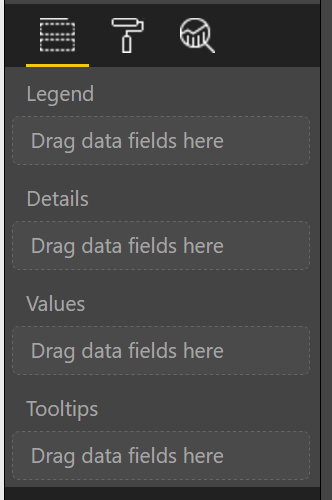

#Data Roles
---
Data roles are how you define the fields into which your visualization will accept data.



Each of the fields there has a data role that is defined under the `dataRoles` attribute of `capabilities.json`.

##Anatomy of a Data Role
You can see an example of the minimal data role in the default visual if you look at `capabilities.json`.
A complete data role will look like this:

```
{
  "displayName": "DisplayName",
  "name": "displayname",
  "kind": "Grouping|Measure|GroupingOrMeasure",
  "requiredTypes": [ { ... }, ... ],
  "description": "This is an example field."
}
```

###`displayName`
Required. This is the name that will be presented to the user. It should be short and precise.

###`name`
Required. This is the internal name for the data field. We will use this name to reference the data field in the future. As such, it must be unique, and should be easily identifiable. Keep in mind that any references to it will be case sensitive.

###`description`
A brief description of what the field does and/or what kinds of data should be given to it. It will be a tooltip, so it should be short.

###`kind`
Required. This defines what kind of field you are describing. There are three different kinds: `Measure`, `Grouping`, and `GroupingOrMeasure`. Contrary to what the official documentation says, you must use one of those three string enums, rather than the old `0`,`1`,`2` integer enums.

Each kind fills a different purpose:

`Measure`: These are numeric fields. This means that any field put into this role will be aggregated. This is things like sale data, profits, volume, etc.

`Grouping`: These are fields that do not get aggregated and are used for grouping the `Measure` fields. Things like category names, latitude or longitude values, ID numbers, etc.

`GroupingOrMeasure`: These can be either. In general, it is best to give your data roles one of `Grouping` or `Measure`, but if you truly must be both, use this kind.

###`requiredTypes`
Defines the types of data that will be accepted. An example looks like:
```
"requiredTypes": [
    {
      "numeric": true
    }
]
```
The possible types you can use are listed in `.api/schema.capabilities.json`, around line 766 at the time of writing, and a list is transposed below:
*   `bool`
*   `enumeration`
*   `fill`
*   `formatting`
*   `integer`
*   `numeric`
*   `filter`
*   `operations`
*   `text`
*   `scripting`
*   `geography`

In general, you will probably only use the primitive types.

---
The official documentation for data roles is available [here](https://github.com/Microsoft/PowerBI-visuals/blob/master/Capabilities/Capabilities.md#define-the-data-fields-your-visual-expects---dataroles). Be warned that some of it is out of date and was very limited to begin with.
