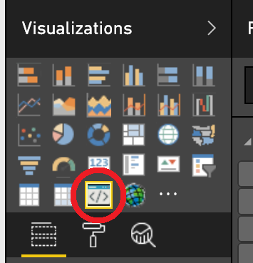
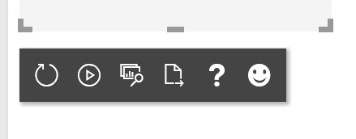

#Setting Up Your Environment
---
##Dependencies
*   [NodeJS 4.0+](https://nodejs.org)
*   pbiviz
    *   `npm install -g powerbi-visuals-tools`

##Creating a New Visual
Complete the following steps using the command line:
1.   Navigate to the directory you want to keep your visuals in.
     1. `cd powerbi-visuals`
2.   Create a new visual template with `pbiviz`. We are going to name ours 'samplePiChart'.
     1. `pbiviz new samplePiChart`
3.   Navigate into the newly created project folder.
     1. `cd samplePiChart`
4.   Install your dependencies using npm. This step will be important once we start adding external libraries.
     1. `npm install`

##Viewing your visual
Once you have created the new visual template, the only thing left to do is view it. There are two ways of looking at the visual while we are developing, live reloading and packaging. I personally recommend that you use the live reloading method, since it will give you access to the log and is much faster to update. If you cannot use live reloading for whatever reason or want to view the visual in the desktop client, you can package your visual and import it.

###Live Reloading
1.   Add a trusted certificate for localhost. To do so, follow the instructions [here](https://github.com/Microsoft/PowerBI-visuals/blob/master/tools/CertificateSetup.md).
2.   Enable developer visuals on the Power BI web client. For instructions on enabling developer visuals, look [here](https://github.com/Microsoft/PowerBI-visuals/blob/master/tools/DebugVisualSetup.md).
3.   Start serving your visual. Once the server is up and running, it will automatically build and re-deploy the visual. Note that you must execute this at the root of the project.
     1. `pbiviz start`
4.   Add the visual to your report. It will be in the Visualizations pane.

       

5.  The visual on the report will not automatically update when the visual gets re-deployed, however you can set it to automatically refresh itself. You can also manually refresh it. This toolbar will appear below the developer visual while it is selected. To manually refresh the visual, click the circular arrow. To have the visual automatically refresh, click the play button.

      

###Packaging
1.   Package the visual into `samplePiChart.pbiviz`. Note that you must execute this at the root of the project.
     1. `pbiviz package`
2.   If this is the first time you have run `pbiviz package`, it will create the `dist` folder in the root directory. The generated `samplePiChart.pbiviz` will be in the `dist` folder.
3.   Now import your visual into the Power BI desktop client. Instructions on importing a custom visual can be found [here](https://powerbi.microsoft.com/en-us/documentation/powerbi-custom-visuals-use/).

---
Official instructions for setting up your environment can be found [here](https://github.com/Microsoft/PowerBI-visuals/blob/master/tools/README.md#installation).
